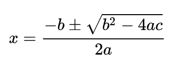

# TP4 - Trabajo Práctico 4

## Temas evaluados

Funciones, parámetros, retorno de valores, uso y composición de funciones, condicionales, operaciones matemáticas, strings y f-strings.

## Cómo ejecutar los tests

Para verificar todos los ejercicios:
```
pytest
```

Para verificar un ejercicio en particular:
```
pytest test_tp4_maximums.py
```

---

## Ejercicios

### Ejercicio 1 — `maximums.py`

**Archivo de test:** `test_tp4_maximums.py`

**Conceptos:** Funciones, parámetros, condicionales, comparación de números.

**Consigna:** Implementar las funciones dadas para que cumplan con su objetivo. Para saber cómo implementar cada método, leer el python-doc.

```python
def max_of_two(x, y):
    """Given x and y, that are 2 numbers, return the biggest number."""
    return "ANSWER HERE" # Remove this line and implement

def max_of_three(x, y, z):
    """Given x, y and z, that are 3 numbers, return the biggest number of the three."""
    return "ANSWER HERE" # Remove this line and implement
```

**Ejemplos:**
- `max_of_two(5, 4)` → `5`
- `max_of_two(-2, -3)` → `-2`
- `max_of_two(0, 0)` → `0`
- `max_of_three(5, 4, 7)` → `7`
- `max_of_three(-2, -3, -1)` → `-1`
- `max_of_three(0, 0, 0)` → `0`

### Ejercicio 2 — `number_to_month.py`

**Archivo de test:** `test_tp4_number_to_month.py`

**Conceptos:** Funciones, condicionales, retorno de strings.

**Consigna:** Implementar la función `number_to_month` que dado un número entre el 1 y el 12, retorne el nombre del mes que representa en el calendario. Si el número no está entre el rango 1 y 12, se deberá retornar la palabra `"error"`. Todos los meses deberán ser en minúscula.

```python
def number_to_month(month):
    return "ANSWER HERE" # Remove this line and implement
```

**Ejemplos:**
- `number_to_month(1)` → `"enero"`
- `number_to_month(12)` → `"diciembre"`
- `number_to_month(99)` → `"error"`

### Ejercicio 3 — `quadratic.py`

**Archivo de test:** `test_tp4_quadratic.py`

**Conceptos:** Funciones, operaciones matemáticas, raíz cuadrada, discriminante, formateo de strings.

**Consigna:** Completar, definir e implementar los métodos necesarios para resolver una ecuación cuadrática de 2º grado:

- `roots(a, b, c)`: devolverá un String de la forma `"(r1, r2)"` o `"(r12)"` o `"( )"` según tenga dos raíces, una raíz o ninguna.
- `value_y(a, b, c, x)`: devolverá el valor de Y para un valor de X que se le pasa como parámetro.
- `to_string(a, b, c)`: devolverá un String mostrando la ecuación `"f(x) = A * X^2 + B * X + C"` reemplazando los valores de a, b y c.
- `derivation(a, b, c)`: devolverá un String mostrando la función lineal que resulta de derivar la función cuadrática.

```python
def roots(a, b, c):
    return "ANSWER HERE"

def value_y(a, b, c, x):
    return "ANSWER HERE"

def to_string(a, b, c):
    return "ANSWER HERE"

def derivation(a, b, c):
    return "ANSWER HERE"
```

**HINT:** Para resolver una cuadrática utilizar:



**Ejemplos:**
- `roots(1, -3, 2)` → `"(2.0, 1.0)"`
- `roots(1, -2, 1)` → `"(1.0)"`
- `roots(1, 2, 3)` → `"( )"`
- `value_y(1, -3, 2, 0)` → `2`
- `value_y(1, -3, 2, 1)` → `0`
- `value_y(1, -3, 2, -1)` → `6`
- `to_string(2, -3, 1)` → `"f(x) = 2 * X^2 + -3 * X + 1"`
- `derivation(2, -3, 1)` → `"f'(x) = 4x + -3"`

### Ejercicio 4 — `classify_number.py`

**Archivo de test:** `test_tp4_classify_number.py`

**Conceptos:** Uso de funciones existentes, condicionales, operadores lógicos.

**Consigna:** En este ejercicio se proveen dos funciones ya implementadas: `is_even(n)` e `is_positive(n)`. El alumno debe **usar** estas funciones (no reimplementar la lógica) para implementar `classify_number(n)` que clasifica un número entero.

Las funciones provistas son:
```python
def is_even(n):
    """Dado un número entero n, retorna True si es par, False si es impar."""
    return n % 2 == 0

def is_positive(n):
    """Dado un número entero n, retorna True si es mayor a 0, False en caso contrario."""
    return n > 0
```

La función a implementar:
```python
def classify_number(n):
    """Retorna: "positive even", "positive odd", "negative even", "negative odd" o "zero"."""
    return "ANSWER HERE"  # Remove this line and implement
```

**Ejemplos:**
- `classify_number(4)` → `"positive even"`
- `classify_number(3)` → `"positive odd"`
- `classify_number(-2)` → `"negative even"`
- `classify_number(-1)` → `"negative odd"`
- `classify_number(0)` → `"zero"`

### Ejercicio 5 — `price_calculator.py`

**Archivo de test:** `test_tp4_price_calculator.py`

**Conceptos:** Composición de funciones, operaciones matemáticas, redondeo, condicionales.

**Consigna:** Se proveen dos funciones ya implementadas: `apply_discount(price, discount_pct)` y `apply_tax(price, tax_pct)`. El alumno debe **usar** estas funciones para implementar `final_price` y `best_deal`.

Las funciones provistas son:
```python
def apply_discount(price, discount_pct):
    """Dado un precio y un porcentaje de descuento, retorna el precio con el descuento aplicado."""
    return price * (1 - discount_pct / 100)

def apply_tax(price, tax_pct):
    """Dado un precio y un porcentaje de impuesto, retorna el precio con el impuesto aplicado."""
    return price * (1 + tax_pct / 100)
```

Las funciones a implementar:
```python
def final_price(price, quantity, discount_pct, tax_pct):
    """
    1. Calcular subtotal (price * quantity).
    2. Aplicar descuento al subtotal usando apply_discount.
    3. Aplicar impuesto al resultado usando apply_tax.
    4. Retornar redondeado a 2 decimales con round().
    """
    return "ANSWER HERE"

def best_deal(price_a, qty_a, disc_a, price_b, qty_b, disc_b, tax_pct):
    """
    Dados dos productos A y B, retorna "A" o "B" según cuál tenga menor precio final.
    Si son iguales, retorna "A". Debe USAR final_price.
    """
    return "ANSWER HERE"
```

**Ejemplos:**
- `final_price(100, 2, 10, 21)` → `217.8`
- `final_price(50, 1, 0, 10)` → `55.0`
- `best_deal(100, 1, 50, 100, 1, 20, 10)` → `"A"`
- `best_deal(50, 2, 0, 50, 1, 10, 21)` → `"B"`

### Ejercicio 6 — `text_analyzer.py`

**Archivo de test:** `test_tp4_text_analyzer.py`

**Conceptos:** Composición de funciones, strings, f-strings, porcentajes.

**Consigna:** Se proveen dos funciones ya implementadas: `count_vowels(text)` y `count_consonants(text)`. El alumno debe **usar** estas funciones para implementar `total_letters`, `vowel_percentage` y `analyze_text`. Cada función puede (y debe) usar las anteriores.

Las funciones provistas son:
```python
def count_vowels(text):
    """Dado un texto, retorna la cantidad de vocales (a, e, i, o, u) que contiene."""

def count_consonants(text):
    """Dado un texto, retorna la cantidad de consonantes que contiene."""
```

Las funciones a implementar:
```python
def total_letters(text):
    """Retorna la cantidad total de letras. Debe USAR count_vowels y count_consonants."""
    return "ANSWER HERE"

def vowel_percentage(text):
    """Retorna el porcentaje de vocales sobre el total de letras, redondeado a 1 decimal.
    Si no hay letras, retorna 0.0. Debe USAR count_vowels y total_letters."""
    return "ANSWER HERE"

def analyze_text(text):
    """Retorna un string con formato: "V:{vowels} C:{consonants} T:{total} P:{percentage}%"
    Debe USAR todas las funciones anteriores."""
    return "ANSWER HERE"
```

**Ejemplos:**
- `total_letters("hola")` → `4`
- `vowel_percentage("hola")` → `50.0`
- `analyze_text("hola")` → `"V:2 C:2 T:4 P:50.0%"`
- `analyze_text("hola mundo")` → `"V:4 C:5 T:9 P:44.4%"`
- `analyze_text("Python 3")` → `"V:1 C:5 T:6 P:16.7%"`
